# Chapter 3 — System Analysis & Design Diagrams

> **Note**: Copy the Mermaid code blocks below and paste them into [Mermaid Live Editor](https://mermaid.live/) or use them in draw.io/Lucidchart to generate visual diagrams.

---

## 3.1 Use Case Diagrams

### 3.1.1 Student Use Cases

```mermaid
graph TB
    Student((Student))
    
    subgraph "Authentication"
        UC1[Login]
        UC2[Signup]
        UC3[Logout]
        UC4[Reset Password]
        UC5[Verify Email]
    end
    
    subgraph "Class Management"
        UC6[Browse Classes]
        UC7[View Class Details]
        UC8[Book Class]
        UC9[Cancel Booking]
        UC10[Join Waitlist]
        UC11[View My Classes]
        UC12[Rate Class]
        UC13[Add to Favorites]
    end
    
    subgraph "Learning Activities"
        UC14[Watch Video Lessons]
        UC15[Take Quiz]
        UC16[Submit Assignment]
        UC17[View Progress]
        UC18[Take Notes]
        UC19[Join Discussions]
        UC20[Reply to Discussions]
    end
    
    subgraph "AI Features"
        UC21[AI Study Buddy RAG Chat]
        UC22[Generate Class Summary]
        UC23[Skill Gap Analysis]
        UC24[Get Learning Path Suggestions]
    end
    
    subgraph "Communication"
        UC25[Send Message]
        UC26[View Messages]
        UC27[View Notifications]
    end
    
    subgraph "Peer Help"
        UC28[Post Help Request]
        UC29[Volunteer as Peer Helper]
        UC30[Complete Peer Session]
    end
    
    subgraph "Certificates"
        UC31[View Certificates]
        UC32[Verify Certificate]
    end
    
    subgraph "Profile"
        UC33[View Profile]
        UC34[Edit Profile]
        UC35[Update Settings]
    end
    
    Student --> UC1
    Student --> UC2
    Student --> UC3
    Student --> UC4
    Student --> UC5
    Student --> UC6
    Student --> UC7
    Student --> UC8
    Student --> UC9
    Student --> UC10
    Student --> UC11
    Student --> UC12
    Student --> UC13
    Student --> UC14
    Student --> UC15
    Student --> UC16
    Student --> UC17
    Student --> UC18
    Student --> UC19
    Student --> UC20
    Student --> UC21
    Student --> UC22
    Student --> UC23
    Student --> UC24
    Student --> UC25
    Student --> UC26
    Student --> UC27
    Student --> UC28
    Student --> UC29
    Student --> UC30
    Student --> UC31
    Student --> UC32
    Student --> UC33
    Student --> UC34
    Student --> UC35
```

### 3.1.2 Tutor Use Cases

```mermaid
graph TB
    Tutor((Tutor))
    
    subgraph "Authentication"
        UC1[Login]
        UC2[Signup]
        UC3[Logout]
        UC4[Reset Password]
        UC5[Verify Email]
    end
    
    subgraph "Class Management"
        UC6[Create Class]
        UC7[Edit Class]
        UC8[Delete Class]
        UC9[View My Classes]
        UC10[Manage Bookings]
        UC11[Approve/Reject Bookings]
        UC12[Start Live Class Zoom]
        UC13[View Class Analytics]
    end
    
    subgraph "Content Creation"
        UC14[Create Lesson]
        UC15[Edit Lesson]
        UC16[Create Quiz]
        UC17[Create Assignment]
        UC18[Grade Assignments]
        UC19[View Quiz Results]
    end
    
    subgraph "AI Features"
        UC20[AI Lesson Planner]
        UC21[AI Quiz Generator]
        UC22[AI Profile Tips]
    end
    
    subgraph "Communication"
        UC23[Send Message]
        UC24[View Messages]
        UC25[View Notifications]
        UC26[Reply to Discussions]
    end
    
    subgraph "Reviews"
        UC27[View Reviews]
        UC28[Respond to Reviews]
    end
    
    subgraph "Profile"
        UC29[View Profile]
        UC30[Edit Profile]
        UC31[Update Settings]
        UC32[View Earnings]
    end
    
    Tutor --> UC1
    Tutor --> UC2
    Tutor --> UC3
    Tutor --> UC4
    Tutor --> UC5
    Tutor --> UC6
    Tutor --> UC7
    Tutor --> UC8
    Tutor --> UC9
    Tutor --> UC10
    Tutor --> UC11
    Tutor --> UC12
    Tutor --> UC13
    Tutor --> UC14
    Tutor --> UC15
    Tutor --> UC16
    Tutor --> UC17
    Tutor --> UC18
    Tutor --> UC19
    Tutor --> UC20
    Tutor --> UC21
    Tutor --> UC22
    Tutor --> UC23
    Tutor --> UC24
    Tutor --> UC25
    Tutor --> UC26
    Tutor --> UC27
    Tutor --> UC28
    Tutor --> UC29
    Tutor --> UC30
    Tutor --> UC31
    Tutor --> UC32
```

### 3.1.3 Coordinator Use Cases

```mermaid
graph TB
    Coordinator((Coordinator))
    
    subgraph "Authentication"
        UC1[Login]
        UC2[Logout]
        UC3[Reset Password]
    end
    
    subgraph "User Management"
        UC4[View All Users]
        UC5[Approve Tutor Applications]
        UC6[Block User]
        UC7[Unblock User]
        UC8[View User Details]
        UC9[Filter by Orphanage/Organization]
    end
    
    subgraph "Peer Help Management"
        UC10[View Help Requests]
        UC11[Approve Peer Sessions]
        UC12[Reject Peer Sessions]
        UC13[View Peer Helpers]
        UC14[Add Coordinator Notes]
    end
    
    subgraph "Content Moderation"
        UC15[View All Classes]
        UC16[Moderate Classes]
        UC17[View Discussions]
        UC18[Moderate Discussions]
    end
    
    subgraph "Safeguarding"
        UC19[View Reports]
        UC20[Investigate Reports]
        UC21[Resolve Reports]
        UC22[Dismiss Reports]
    end
    
    subgraph "Analytics"
        UC23[View Dashboard Statistics]
        UC24[View Platform Metrics]
        UC25[Generate Reports]
    end
    
    subgraph "Notifications"
        UC26[Send System Notifications]
        UC27[Send Email Broadcasts]
    end
    
    Coordinator --> UC1
    Coordinator --> UC2
    Coordinator --> UC3
    Coordinator --> UC4
    Coordinator --> UC5
    Coordinator --> UC6
    Coordinator --> UC7
    Coordinator --> UC8
    Coordinator --> UC9
    Coordinator --> UC10
    Coordinator --> UC11
    Coordinator --> UC12
    Coordinator --> UC13
    Coordinator --> UC14
    Coordinator --> UC15
    Coordinator --> UC16
    Coordinator --> UC17
    Coordinator --> UC18
    Coordinator --> UC19
    Coordinator --> UC20
    Coordinator --> UC21
    Coordinator --> UC22
    Coordinator --> UC23
    Coordinator --> UC24
    Coordinator --> UC25
    Coordinator --> UC26
    Coordinator --> UC27
```

---

## 3.2 System Architecture

### 3.2.1 High-Level Architecture Diagram

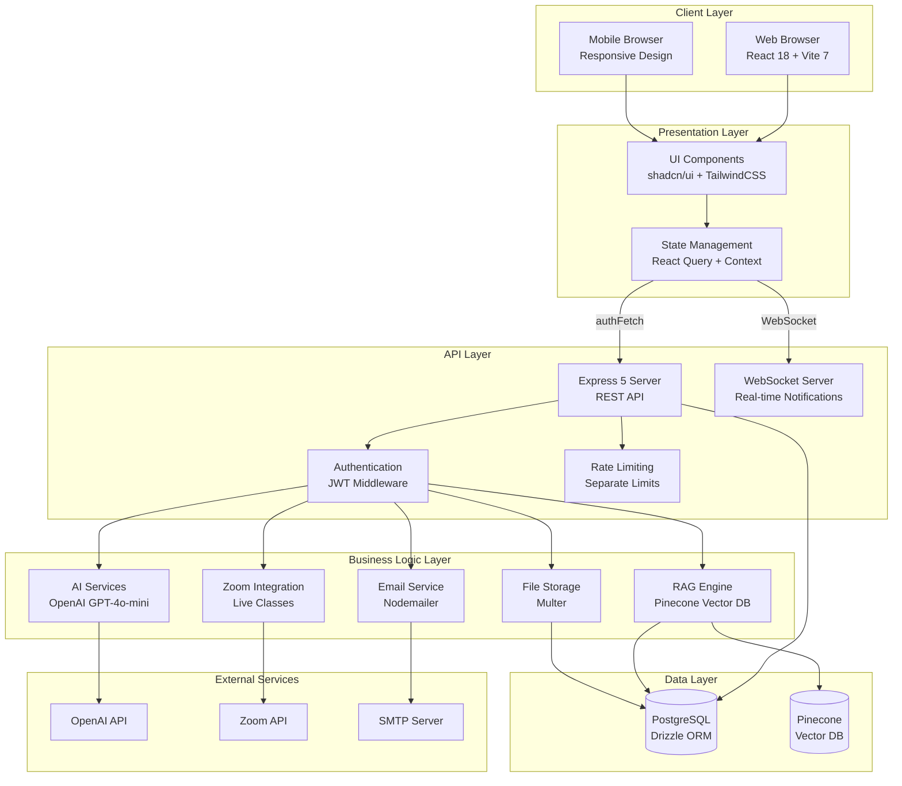

### 3.2.2 3-Tier Architecture Explanation

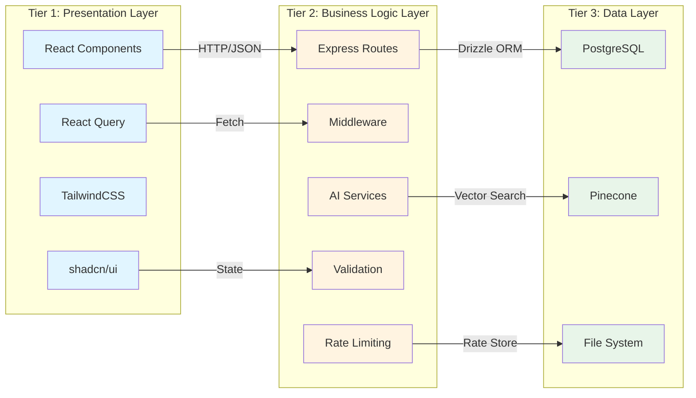

**Tier 1: Presentation Layer**
- Handles user interface and user experience
- React 18 components with shadcn/ui library
- TailwindCSS for responsive styling
- React Query for server state management
- WebSocket client for real-time updates

**Tier 2: Business Logic Layer**
- Express 5 server with RESTful API endpoints
- Authentication middleware (JWT)
- Rate limiting (separate for auth, AI, uploads)
- Input validation and sanitization
- AI service integration (OpenAI, Pinecone)
- Zoom API integration for live classes
- Email service (Nodemailer)

**Tier 3: Data Layer**
- PostgreSQL database with Drizzle ORM
- Pinecone vector database for RAG
- File system for uploaded content
- Redis-like in-memory rate limit store

---

## 3.3 Database Design

### 3.3.1 ER Diagram (23 Tables)

```mermaid
erDiagram
    users ||--o{ classes : creates
    users ||--o{ bookings : books
    users ||--o{ bookings : tutors
    users ||--o{ messages : sends
    users ||--o{ messages : receives
    users ||--o{ reviews : writes
    users ||--o{ reviews : receives
    users ||--o{ notifications : receives
    users ||--o{ favorites : adds
    users ||--o{ user_settings : has
    users ||--o{ course_progress : tracks
    users ||--o{ safeguarding_reports : files
    users ||--o{ lessons : creates
    users ||--o{ quizzes : creates
    users ||--o{ quiz_results : takes
    users ||--o{ assignments : creates
    users ||--o{ assignment_submissions : submits
    users ||--o{ notes : takes
    users ||--o{ certificates : earns
    users ||--o{ discussions : starts
    users ||--o{ discussion_replies : writes
    users ||--o{ login_history : has
    users ||--o{ email_verification_tokens : has
    users ||--o{ password_reset_tokens : has
    users ||--o{ peer_helpers : volunteers
    users ||--o{ peer_help_requests : posts
    users ||--o{ peer_sessions : requests
    users ||--o{ peer_sessions : helps
    users ||--o{ peer_sessions : approves
    
    classes ||--o{ bookings : has
    classes ||--o{ favorites : in
    classes ||--o{ course_progress : for
    classes ||--o{ lessons : contains
    classes ||--o{ quizzes : has
    classes ||--o{ assignments : has
    classes ||--o{ notes : for
    classes ||--o{ certificates : for
    classes ||--o{ discussions : has
    classes ||--o{ peer_helpers : for
    classes ||--o{ peer_help_requests : for
    classes ||--o{ peer_sessions : for
    
    bookings ||--o{ certificates : generates
    
    quizzes ||--o{ quiz_results : has
    
    assignments ||--o{ assignment_submissions : receives
    
    discussions ||--o{ discussion_replies : has
    
    peer_help_requests ||--o{ peer_sessions : becomes
    
    users {
        serial id PK
        text name
        text email UK
        text password
        role_enum role
        text avatar
        text bio
        text orphanage
        text organization
        text_array skills_taught
        text_array skills_learning
        numeric rating
        integer total_reviews
        boolean is_verified
        boolean is_blocked
        boolean is_pending_approval
        integer failed_login_attempts
        timestamp locked_until
        integer token_version
        text last_login_ip
        timestamp deleted_at
        timestamp created_at
    }
    
    classes {
        serial id PK
        integer tutor_id FK
        text title
        text description
        text category
        skill_level_enum skill_level
        integer duration
        integer max_students
        class_status_enum status
        course_type_enum course_type
        text thumbnail_url
        text video_url
        text recording_url
        timestamp recording_available_until
        boolean is_recording_available
        integer total_lectures
        integer completed_lectures
        integer view_count
        text language
        boolean is_free
        numeric price
        text schedule_type
        timestamp schedule_date
        text schedule_time
        text_array recurring_days
        integer enrolled_count
        text zoom_meeting_id
        text zoom_meeting_url
        text zoom_host_url
        jsonb certificate_criteria
        timestamp created_at
    }
    
    bookings {
        serial id PK
        integer student_id FK
        integer class_id FK
        integer tutor_id FK
        timestamp scheduled_date
        text scheduled_time
        integer duration
        booking_status_enum status
        boolean reminder_sent
        timestamp created_at
    }
    
    messages {
        serial id PK
        integer sender_id FK
        integer receiver_id FK
        text content
        boolean is_read
        text conversation_id
        timestamp created_at
    }
    
    reviews {
        serial id PK
        integer reviewer_id FK
        integer reviewee_id FK
        integer class_id FK
        integer rating
        text comment
        timestamp created_at
    }
    
    notifications {
        serial id PK
        integer user_id FK
        notification_type_enum type
        text title
        text message
        text link
        boolean is_read
        timestamp created_at
    }
    
    favorites {
        serial id PK
        integer user_id FK
        integer class_id FK
        timestamp created_at
    }
    
    user_settings {
        serial id PK
        integer user_id FK UK
        boolean email_notifications
        boolean push_notifications
        boolean booking_reminders
        boolean message_alerts
        boolean review_notifications
        boolean marketing_emails
        text messaging_preference
        boolean show_profile_publicly
        integer session_timeout
        text theme
        text language
        text timezone
        boolean autoplay_videos
        text learning_goals
        text_array preferred_subjects
        boolean study_reminders
        text teaching_preferences
        jsonb availability_schedule
        boolean platform_alerts
        timestamp created_at
    }
    
    course_progress {
        serial id PK
        integer user_id FK
        integer class_id FK
        integer lecture_number
        boolean completed
        timestamp last_watched_at
        integer watch_time_seconds
        timestamp created_at
    }
    
    safeguarding_reports {
        serial id PK
        integer reporter_id FK
        report_type_enum report_type
        report_target_enum target_type
        integer target_id
        text description
        report_status_enum status
        integer resolved_by FK
        timestamp resolved_at
        text admin_notes
        timestamp created_at
    }
    
    contact_submissions {
        serial id PK
        text name
        text email
        text subject
        text message
        timestamp created_at
    }
    
    lessons {
        serial id PK
        integer class_id FK
        integer tutor_id FK
        text title
        text description
        text content
        integer duration
        text difficulty
        jsonb sections
        jsonb attachments
        timestamp created_at
    }
    
    quizzes {
        serial id PK
        integer class_id FK
        integer tutor_id FK
        text title
        text description
        jsonb questions
        integer time_limit
        integer passing_score
        integer max_attempts
        timestamp created_at
    }
    
    quiz_results {
        serial id PK
        integer quiz_id FK
        integer student_id FK
        integer score
        text answers
        boolean passed
        timestamp completed_at
    }
    
    assignments {
        serial id PK
        integer class_id FK
        integer tutor_id FK
        text title
        text description
        text instructions
        timestamp due_date
        integer max_score
        boolean allow_late_submission
        jsonb rubric
        timestamp created_at
    }
    
    assignment_submissions {
        serial id PK
        integer assignment_id FK
        integer student_id FK
        text content
        text file_url
        integer grade
        text feedback
        timestamp graded_at
        timestamp submitted_at
    }
    
    notes {
        serial id PK
        integer user_id FK
        integer class_id FK
        text topic
        text content
        text_array tags
        timestamp created_at
    }
    
    certificates {
        serial id PK
        integer student_id FK
        integer class_id FK
        integer booking_id FK
        text student_name
        text course_name
        text tutor_name
        text verification_code UK
        timestamp issued_at
    }
    
    discussions {
        serial id PK
        integer class_id FK
        integer author_id FK
        text title
        text content
        boolean is_pinned
        integer reply_count
        timestamp created_at
        timestamp updated_at
    }
    
    discussion_replies {
        serial id PK
        integer discussion_id FK
        integer author_id FK
        text content
        timestamp created_at
    }
    
    login_history {
        serial id PK
        integer user_id FK
        text ip
        text user_agent
        timestamp created_at
    }
    
    email_verification_tokens {
        serial id PK
        text token UK
        integer user_id FK
        timestamp expires_at
        timestamp created_at
    }
    
    class_waitlist {
        serial id PK
        integer class_id FK
        integer student_id FK
        integer position
        boolean notified
        timestamp created_at
    }
    
    password_reset_tokens {
        serial id PK
        text token UK
        integer user_id FK
        timestamp expires_at
        timestamp created_at
    }
    
    peer_helpers {
        serial id PK
        integer user_id FK
        integer class_id FK
        text topic
        integer quiz_score
        timestamp created_at
    }
    
    peer_help_requests {
        serial id PK
        integer student_id FK
        integer class_id FK
        text topic
        text description
        peer_help_request_status_enum status
        integer helper_id FK
        timestamp created_at
    }
    
    peer_sessions {
        serial id PK
        integer request_id FK
        integer requester_id FK
        integer helper_id FK
        integer class_id FK
        text proposed_date
        text proposed_time
        peer_session_status_enum status
        text coordinator_notes
        integer approved_by FK
        timestamp created_at
    }
```

### 3.3.2 Key Tables Summary

| Table | Purpose | Key Fields |
|-------|---------|------------|
| **users** | Core user data with 3 roles | id, role, skills_taught, skills_learning, rating |
| **classes** | Course/class information | id, tutor_id, category, skill_level, zoom_meeting_id |
| **bookings** | Student enrollments | id, student_id, class_id, tutor_id, status |
| **assignments** | Tutor-created assignments | id, class_id, tutor_id, due_date, max_score |
| **assignment_submissions** | Student submissions | id, assignment_id, student_id, grade, feedback |
| **peer_help_requests** | Peer help board | id, student_id, class_id, topic, status, helper_id |
| **certificates** | Course completion certificates | id, student_id, class_id, verification_code |
| **notifications** | User notifications | id, user_id, type, title, message, is_read |

---

## 3.4 API Design

### 3.4.1 RESTful API Endpoints Overview

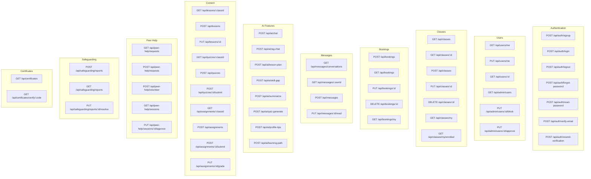

### 3.4.2 Authentication Flow Diagram

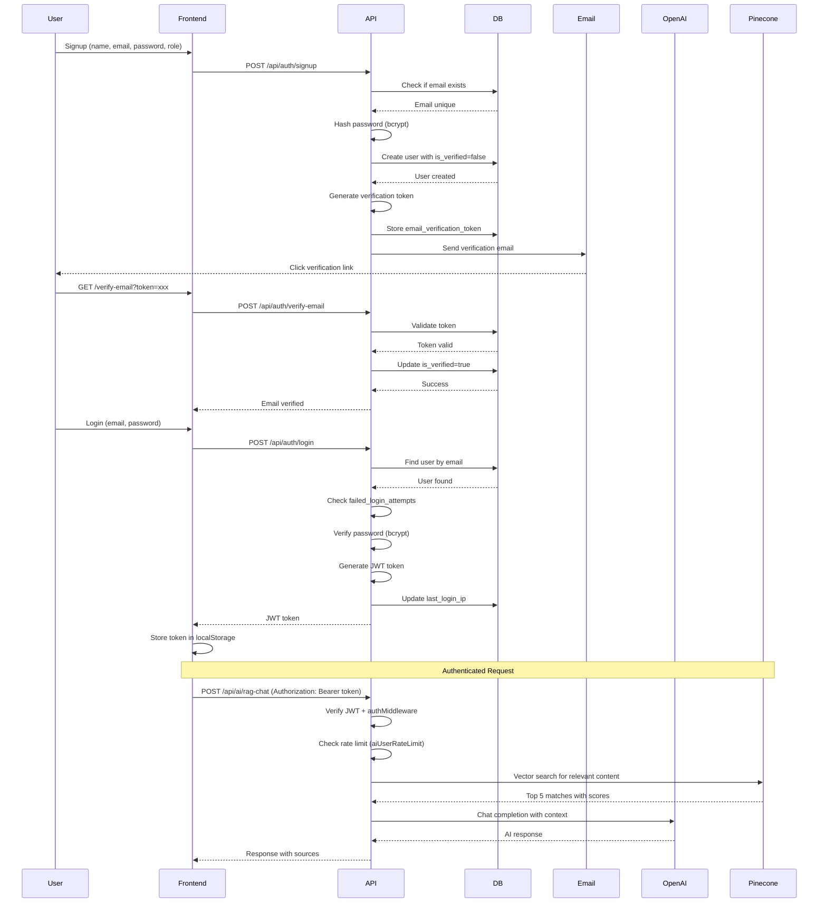

---

## 3.5 Security Design

### 3.5.1 Security Architecture Diagram

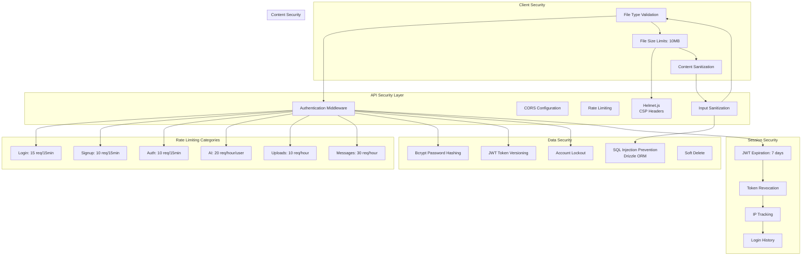

### 3.5.2 Security Measures Summary

| Security Layer | Implementation | Purpose |
|----------------|----------------|---------|
| **Authentication** | JWT + Bcrypt | Secure password storage and token-based auth |
| **Rate Limiting** | Separate limits per endpoint | Prevent abuse and DDoS |
| **Input Validation** | Zod schemas + sanitization | Prevent XSS and injection attacks |
| **CORS** | Configured origins | Prevent cross-origin attacks |
| **Helmet.js** | CSP headers | Security headers for browser protection |
| **Account Lockout** | Failed login attempts | Prevent brute force attacks |
| **Token Versioning** | Revocation on password reset | Invalidate old sessions |
| **File Upload** | Type + size validation | Prevent malicious uploads |
| **SQL Injection** | Drizzle ORM parameterized queries | Prevent SQL injection |

---

## 3.6 UI/UX Design

### 3.6.1 Main Dashboard Wireframe

```mermaid
graph TB
    subgraph "Layout"
        Header[Header<br/>Logo + Navigation + User Menu]
        Sidebar[Sidebar<br/>Dashboard | Classes | Messages | Settings]
        Main[Main Content Area]
    end
    
    subgraph "Dashboard Components"
        Stats[Statistics Cards<br/>Total Classes | Enrolled | Completed | Rating]
        Recent[Recent Activity<br/>Bookings | Messages | Notifications]
        AI[AI Features<br/>Study Buddy | Skill Gap | Learning Path]
        Classes[My Classes<br/>Grid of enrolled classes]
    end
    
    Header --> Sidebar
    Header --> Main
    Sidebar --> Main
    
    Main --> Stats
    Main --> Recent
    Main --> AI
    Main --> Classes
    
    style Header fill:#4f46e5,color:#fff
    style Sidebar fill:#f3f4f6
    style Main fill:#ffffff
    style Stats fill:#e0e7ff
    style AI fill:#fef3c7
```

### 3.6.2 Dark/Light Mode Architecture

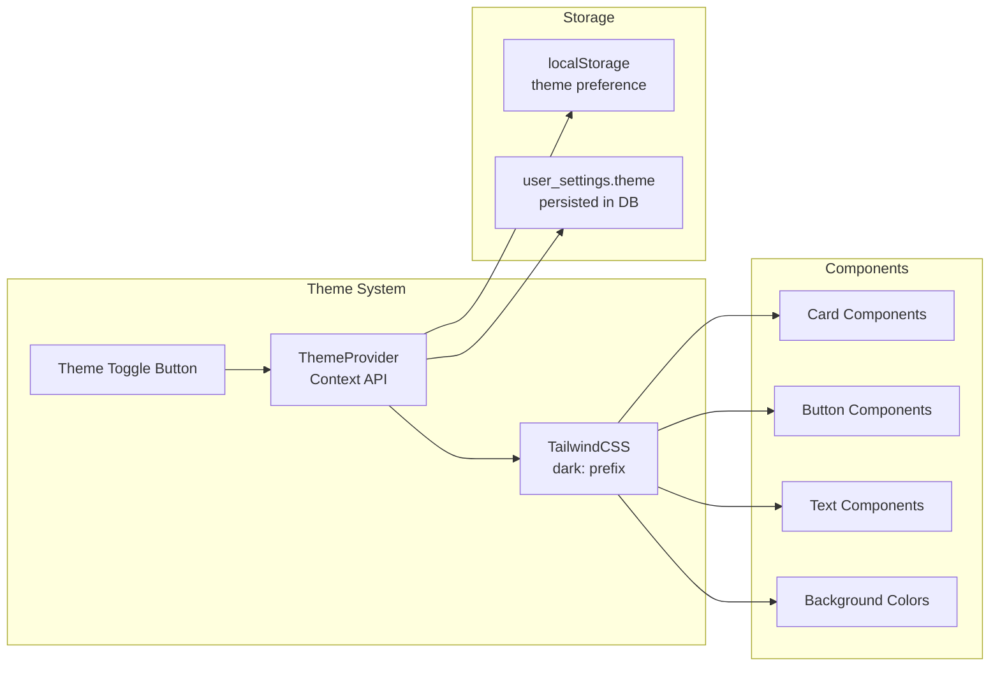

### 3.6.3 Responsive Design Breakpoints

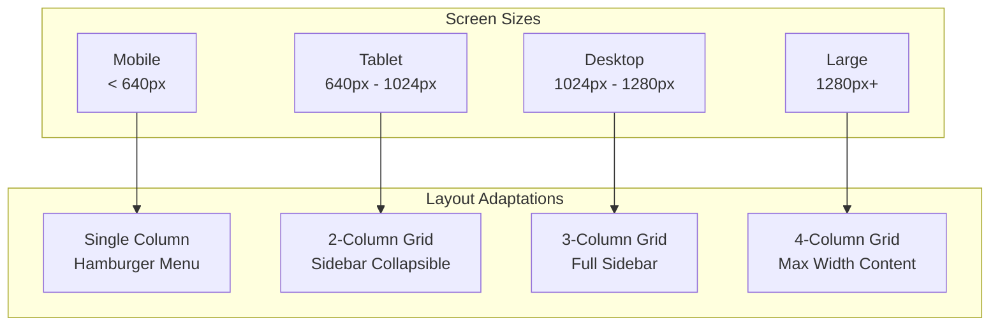

### 3.6.4 Key UI Components (shadcn/ui)

| Component | Usage | Styling |
|-----------|-------|---------|
| **Card** | Content containers | Border, shadow, rounded corners |
| **Button** | Actions | Primary/secondary/outline variants |
| **Input** | Forms | Validation states, icons |
| **Select** | Dropdowns | Custom options, searchable |
| **Dialog** | Modals | Overlay, close on escape |
| **Tabs** | Content switching | Animated transitions |
| **Badge** | Status indicators | Color-coded variants |
| **Avatar** | User profiles | Fallback initials |
| **ScrollArea** | Scrollable content | Custom scrollbar styling |
| **Toast** | Notifications | Auto-dismiss, position |

---

## 3.7 Data Flow Diagrams

### 3.7.1 Student Booking Flow

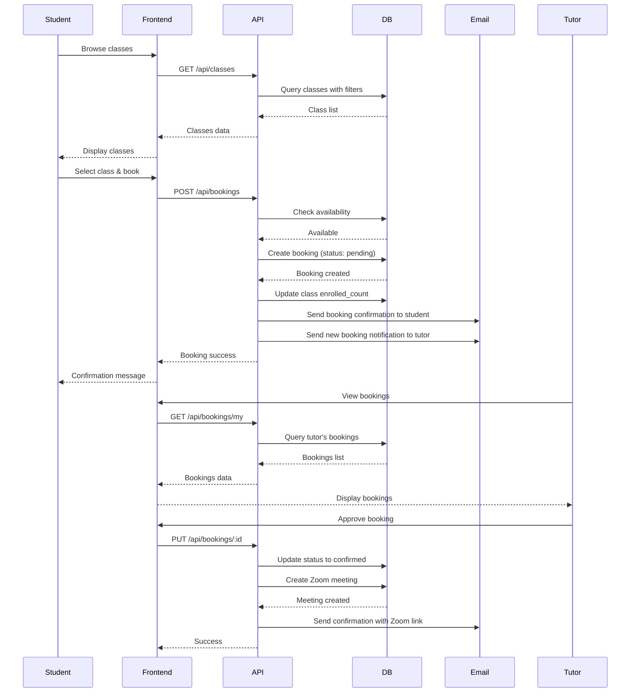

### 3.7.2 AI RAG Chat Flow

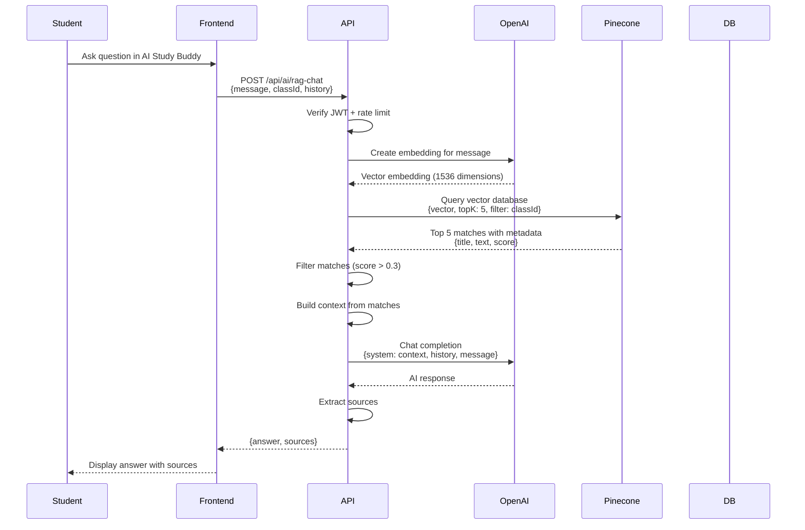

---

## How to Use These Diagrams

1. **For Visual Diagrams**: Copy each Mermaid code block and paste into [Mermaid Live Editor](https://mermaid.live/)
2. **For Documentation**: Export as PNG/SVG from Mermaid Live Editor
3. **For Presentations**: Import SVG files into PowerPoint/Keynote
4. **For LaTeX**: Use Mermaid to generate diagrams, then convert to TikZ if needed

**Recommended Tools**:
- [Mermaid Live Editor](https://mermaid.live/) - Quick preview and export
- [draw.io](https://app.diagrams.net/) - Import Mermaid code
- [Lucidchart](https://www.lucidchart.com/) - Professional diagrams
- [VS Code Mermaid Preview](https://marketplace.visualstudio.com/items?itemName=bierner.markdown-mermaid) - Live preview in editor
